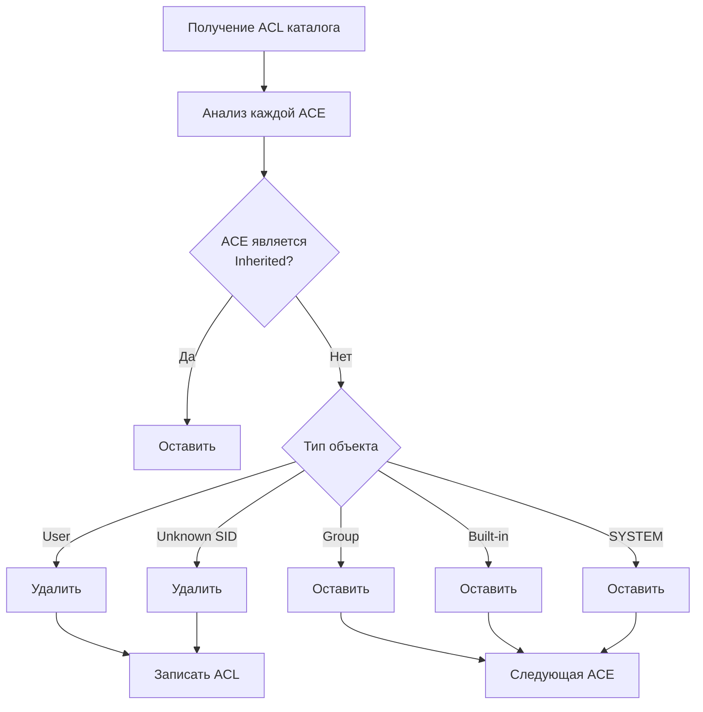
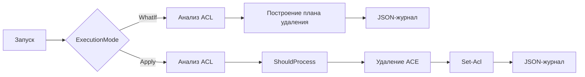
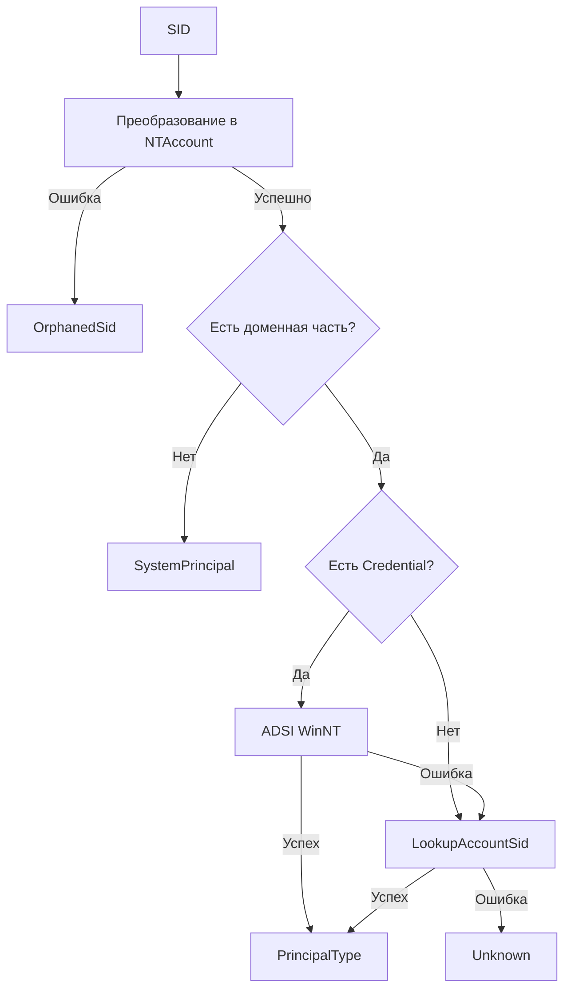
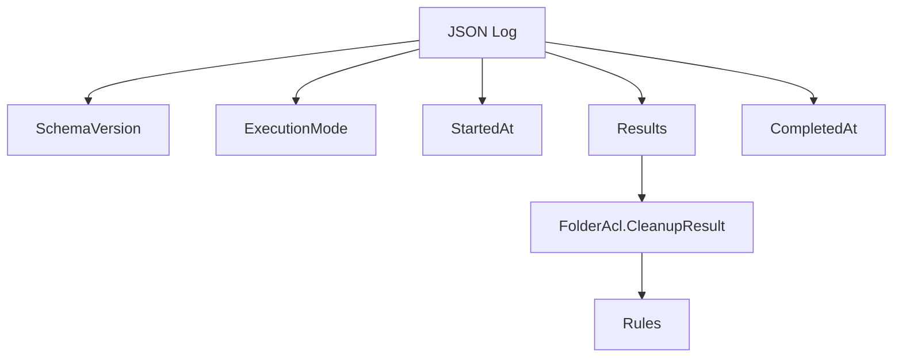
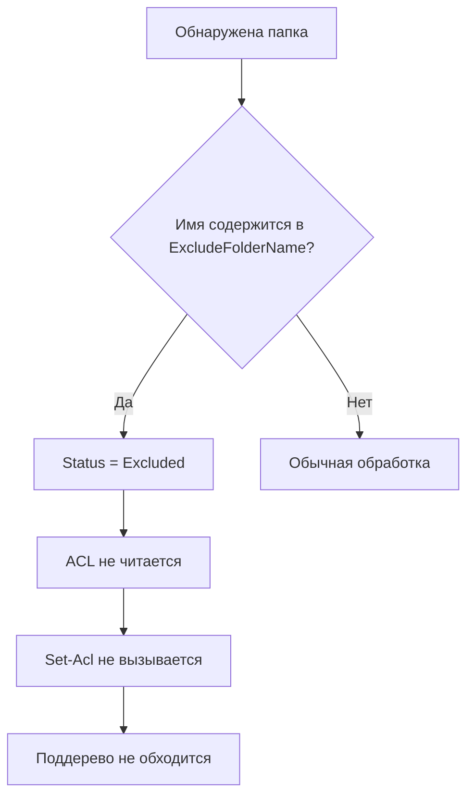

<div align="center">

# 🔐 Clear-FolderGroupAcl

### Безопасная очистка **NTFS ACL** от явных пользовательских разрешений и осиротевших **SID**


**PowerShell-скрипт для безопасной очистки ACL каталогов с сохранением групповых и системных разрешений, владельца и состояния наследования.**

</div>

---

# 📚 Содержание

- [🎯 Назначение](#-назначение)
- [✨ Основные возможности](#-основные-возможности)
- [🛠️ Как устроена очистка ACL](#️-как-устроена-очистка-acl)
  - [📌 Явные правила](#-явные-правила)
  - [📌 Унаследованные правила](#-унаследованные-правила)
  - [📌 Состояние наследования](#-состояние-наследования)
  - [📌 Владелец](#-владелец)
- [📋 Требования](#-требования)
- [📁 Состав файлов](#-состав-файлов)
- [⚙️ Настройка параметров](#️-настройка-параметров)
- [🚀 Запуск](#-запуск)
- [🔄 Режимы WhatIf и Apply](#-режимы-whatif-и-apply)
- [👥 Определение групп и пользователей](#-определение-групп-и-пользователей)
- [📦 Выходные объекты](#-выходные-объекты)
- [📝 JSON-журналы](#-json-журналы)
- [🚫 Исключения](#-исключения)
- [🧪 Тестирование](#-тестирование)
- [🔐 Безопасность](#-безопасность)
- [🩺 Диагностика](#-диагностика)
- [💻 Совместимость и кодировка](#-совместимость-и-кодировка)
- [⚙️ Краткий пример рабочей конфигурации](#️-краткий-пример-рабочей-конфигурации)

---

# 📌 Назначение

Со временем на файловых серверах в **NTFS ACL** накапливаются явные разрешения пользователей и осиротевшие **SID**, что усложняет сопровождение структуры доступа и проведение аудита.

**Clear-FolderGroupAcl.ps1** предназначен для безопасной очистки таких записей.

Во время обработки скрипт:

- рекурсивно анализирует ACL указанных каталогов;
- удаляет только явные **ACE** пользователей и осиротевших **SID**;
- сохраняет доменные, локальные и встроенные группы;
- сохраняет системные субъекты безопасности;
- не изменяет владельца каталога;
- не изменяет состояние наследования (**Inheritance**).

После завершения обработки в **ACL** остаются только групповые и системные правила доступа.

> [!IMPORTANT]
> Скрипт предназначен для запуска **непосредственно на Windows-файловом сервере** под локальной учётной записью администратора, имеющей права на чтение и изменение **DACL** обрабатываемых каталогов.

> [!NOTE]
> Модуль **ActiveDirectory** не используется и не должен устанавливаться на файловый сервер.

---

# ✨ Основные возможности

| Возможность | Описание |
|-------------|----------|
| 📁 Рекурсивная обработка | Проверяет указанную корневую папку и всё дерево вложенных каталогов |
| 📂 Только каталоги | Файлы не обрабатываются |
| ⬇️ Последовательный обход | Сначала обрабатывается родительский каталог, затем дочерние |
| 👤 Очистка User ACE | Удаляет явные разрешения пользователей |
| 🆔 Очистка Unknown SID | Удаляет явные разрешения осиротевших SID |
| 👥 Сохранение групп | Доменные, локальные и встроенные группы остаются без изменений |
| 🛡 Сохранение системных субъектов | Например, `SYSTEM` и `BUILTIN\Administrators` |
| 🔒 Сохранение параметров ACE | Тип правила (`Allow`/`Deny`), права и параметры наследования остаются неизменными |
| 👑 Owner | Владелец каталога никогда не изменяется |
| 🔄 Inheritance | Состояние наследования полностью сохраняется |
| 🚫 Исключения | Поддерживаются точные имена исключаемых папок |
| 🌳 Пропуск поддерева | Исключённый каталог пропускается вместе со всем содержимым |
| 🔁 Защита от циклов | Не обрабатывает точки повторной обработки |
| 🔍 WhatIf | Полностью безопасный предварительный анализ |
| ✔️ Apply | Выполнение изменений с подтверждением |
| 📦 Object Output | Возвращает структурированные PowerShell-объекты |
| 📝 JSON Logging | Формирует корректный JSON-журнал каждого запуска |
| ⚡ Кэширование SID | Повторная классификация SID в пределах одного запуска не выполняется |
| 🛠 Устойчивость к ошибкам | Локальная ошибка не прерывает обработку остальных каталогов |

---

# ⚙️ Как устроена очистка ACL

Во время обработки каждый каталог проходит одинаковую последовательность проверки.



---

## 📍 Явные правила

Явное правило находится непосредственно в **ACL** текущего каталога.

Признак такого правила:

```text
IsInherited = False
```

Если запись относится к пользователю или осиротевшему **SID**, скрипт планирует её удаление.

В режиме **Apply** используется:

- `RemoveAccessRuleSpecific`
- `Set-Acl`

Такой подход позволяет удалить только конкретную **ACE**, не затрагивая остальные записи списка доступа.

---

## 📍 Унаследованные правила

Унаследованное правило имеет признак:

```text
IsInherited = True
```

Такие записи скрипт не удаляет.

Удаление наследуемой записи возможно только в каталоге, от которого она наследуется.

Именно поэтому обработка выполняется **сверху вниз**.

После удаления явной записи в родительском каталоге Windows автоматически обновляет наследуемые **ACL** дочерних каталогов.

### Пример

1. Для каталога `TEST` отключено наследование.
2. Пользователь `DOMAIN\User` присутствует как явная **ACE**.
3. Во вложенных каталогах эта запись отображается как наследуемая.
4. Скрипт удаляет явную **ACE** из каталога `TEST`.
5. Windows автоматически удаляет наследуемые записи во всех дочерних каталогах.

> [!TIP]
> В режиме **WhatIf** изменения фактически не выполняются, поэтому дочерние каталоги могут временно содержать такие записи в `SkippedInheritedRules`. Это является ожидаемым поведением предварительного анализа.

---

## 🔒 Состояние наследования

Скрипт никогда не изменяет механизм наследования.

Если наследование было включено — оно останется включённым.

Если наследование было отключено — оно останется отключённым.

Также скрипт:

- не преобразует наследуемые **ACE** в явные;
- не пересоздаёт групповые правила;
- не изменяет область распространения существующих разрешений.

Это исключает появление дубликатов и случайное изменение структуры доступа.

---

## 👑 Владелец каталога

**Owner** не относится к **DACL**.

Во время работы скрипт получает информацию о владельце исключительно для анализа.

Изменение владельца никогда не выполняется.

---

# 📋 Требования

Для корректной работы необходимо:

- Windows Server или клиентская Windows с файловой системой **NTFS**;
- **Windows PowerShell 5.1**;
- запуск непосредственно на файловом сервере (рекомендуется для корректного разрешения локальных **SID**);
- права чтения **ACL**;
- право **WRITE_DAC** при использовании режима **Apply**;
- доступ файлового сервера к доменной инфраструктуре для разрешения доменных **SID**;
- действующая доменная учётная запись при использовании **ADSI**;
- **Pester 5** — только для запуска тестов;
- **PSScriptAnalyzer** — только для статического анализа.

> [!NOTE]
> Модуль **ActiveDirectory** в работе скрипта не используется.

---

# 🚀 Запуск

Ниже приведён рекомендуемый порядок запуска скрипта, позволяющий безопасно проверить результаты очистки перед внесением изменений в **ACL**.

## 📋 Рекомендуемый порядок

1. Скопируйте `Clear-FolderGroupAcl.ps1` на файловый сервер.
2. Откройте **Windows PowerShell ISE** от имени локального администратора.
3. Настройте параметры `Path` и `ExcludeFolderName`.
4. Убедитесь, что установлен режим:

   ```powershell
   $ExecutionMode = 'WhatIf'
   ```

5. Запустите **весь файл**, а не отдельный выделенный фрагмент.
6. Если включена **ADSI**-проверка, введите доменную учётную запись.
7. Проверьте содержимое:
   - `PlannedRules`
   - `PreservedUnknownRules`
   - JSON-журнала
8. Убедитесь, что в список удаления попали только пользователи и осиротевшие **SID**.
9. После проверки переключите режим на:

   ```powershell
   $ExecutionMode = 'Apply'
   ```

10. При необходимости оставьте:

    ```powershell
    $ConfirmChanges = $true
    ```

11. После завершения очистки рекомендуется повторно выполнить запуск в режиме **WhatIf** для проверки итогового состояния.

> [!TIP]
> Перед первым использованием режима **Apply** рекомендуется полностью проверить результаты предварительного анализа в режиме **WhatIf**.

---

## ▶️ Запуск из PowerShell ISE

Откройте файл **`Clear-FolderGroupAcl.ps1`** и нажмите **`F5`**.

---

## 💻 Запуск из консоли

```powershell
Set-Location 'D:\Scripts\ACL'
.\Clear-FolderGroupAcl.ps1
```

---

## ⚙️ Разовое переопределение параметров

Хотя основные параметры обычно задаются в блоке `param()` в начале скрипта, их можно переопределить непосредственно при запуске.

```powershell
.\Clear-FolderGroupAcl.ps1 `
    -Path 'D:\SharedFolder\Department' `
    -ExcludeFolderName 'Archive' `
    -ExecutionMode WhatIf
```

Такой способ не изменяет значения параметров, заданных в самом файле, и удобен для разовых запусков.

---

## 📦 Загрузка функции без автоматического запуска

Для загрузки функции в текущий сеанс PowerShell используйте точечное подключение.

```powershell
. .\Clear-FolderGroupAcl.ps1
```

При таком способе подключения функция становится доступной в текущем сеансе, однако автоматическая обработка каталогов не выполняется.

После загрузки функцию можно вызвать вручную.

```powershell
Clear-FolderGroupAcl `
    -Path 'D:\SharedFolder\Department' `
    -ExcludeFolderName 'Archive' `
    -WhatIf
```

> [!NOTE]
> Такой способ удобен при разработке, тестировании и интерактивной отладке отдельных сценариев работы скрипта.

---

# 🔄 Режимы WhatIf и Apply

Скрипт поддерживает два режима работы: **WhatIf** и **Apply**.

Оба режима выполняют одинаковый анализ структуры **ACL**, однако различаются тем, изменяется ли файловая система.



---

## 🔍 Режим WhatIf

Режим **WhatIf** предназначен для безопасительного предварительного анализа.

Во время выполнения скрипт:

- читает каталоги и **ACL**;
- определяет пользователей и группы;
- строит план удаления;
- **не вызывает** `Set-Acl`;
- **не удаляет** ACE;
- **не изменяет** владельца;
- **не изменяет** состояние наследования;
- создаёт JSON-журнал.

> [!TIP]
> Единственной ожидаемой записью на диск в режиме **WhatIf** является создание JSON-журнала.

### Поля, которые рекомендуется проверить

```text
Status
PlannedRemovalCount
PlannedRules
SkippedInheritedRules
PreservedUnknownRules
Error
```

---

## ✏️ Режим Apply

Режим **Apply** выполняет тот же анализ, что и **WhatIf**, после чего может внести изменения в **ACL**.

Во время выполнения скрипт:

- выполняет полный анализ ACL;
- вызывает `ShouldProcess`;
- при подтверждении удаляет найденные явные **ACE**;
- записывает изменённый **ACL** через `Set-Acl`;
- создаёт JSON-журнал результата.

Если

```powershell
$ConfirmChanges = $true
```

PowerShell отображает стандартный запрос подтверждения для каждого изменения.

### Возможные ответы

| Ответ | Действие |
|--------|----------|
| **Да** | Выполнить текущее изменение |
| **Да для всех** | Выполнить текущее и все последующие изменения |
| **Нет** | Пропустить текущее изменение |
| **Нет для всех** | Отклонить все последующие изменения |

---

# 👥 Определение групп и пользователей

Перед принятием решения о сохранении или удалении правила каждая запись проходит последовательную классификацию.



---

## 📋 Последовательность классификации

Во время обработки каждого **SID** выполняются следующие проверки.

1. SID преобразуется в `NTAccount`.
2. Если преобразование невозможно, объект получает тип `OrphanedSid`.
3. SID без доменной части классифицируется как `SystemPrincipal`.
4. При наличии `Credential` выполняется проверка через **ADSI WinNT**.
5. Если ADSI недоступна, используется Windows API `LookupAccountSid`.
6. Если определить тип не удалось, объект получает тип `Unknown`.

> [!IMPORTANT]
> Объекты с типом `Unknown` никогда не удаляются автоматически.

---

# 🏷️ Значения `PrincipalType`

| Значение | Описание |
|----------|----------|
| `Group` | Доменная или локальная группа. Правило сохраняется. |
| `SystemPrincipal` | Системный или встроенный SID. Правило сохраняется. |
| `User` | Доменный или локальный пользователь. Явное правило планируется к удалению. |
| `OrphanedSid` | SID не сопоставлен существующей учётной записи. Явное правило планируется к удалению. |
| `Unknown` | Тип объекта определить не удалось. Правило сохраняется для предотвращения ошибочного удаления. |

---

# 🔍 Значения `LookupMethod`

| Значение | Описание |
|----------|----------|
| `AdsiWinNT` | Тип успешно определён через ADSI с указанными учётными данными. |
| `LookupAccountSid` | Тип определён штатной функцией Windows без использования ADSI. |
| `LookupAccountSidFallback` | ADSI завершилась ошибкой, после чего тип успешно определён через `LookupAccountSid`. Причина ошибки сохраняется в `Detail`. |
| `SystemSid` | Запись распознана как системный SID без выполнения дополнительного сетевого запроса. |
| `SidTranslation` | Используется при обработке неразрешаемого или ошибочно разрешённого SID. |
| `Failed` | Все доступные способы классификации завершились ошибкой. Объект сохраняется как `Unknown`. |

> [!NOTE]
> Поля `PrincipalType` и `LookupMethod` используются только для определения типа субъекта безопасности. Решение об удалении принимается на основании комбинации `PrincipalType` и `IsInherited`.

---

# 📦 Выходные объекты

Для каждой обработанной (или пропущенной) папки скрипт возвращает объект типа:

```text
FolderAcl.CleanupResult
```

Каждый объект содержит информацию о результате обработки каталога, количестве найденных правил, произведённых изменениях и возможных ошибках.

---

# 📄 Поля `FolderAcl.CleanupResult`

| Поле | Описание |
|------|----------|
| `Path` | Полный путь к каталогу. |
| `Status` | Результат обработки каталога. |
| `InheritanceEnabled` | Исходное состояние наследования ACL. |
| `Changed` | Признак успешного изменения ACL через `Set-Acl`. |
| `RemovedRuleCount` | Количество фактически удалённых правил. |
| `PlannedRemovalCount` | Количество правил, найденных до вызова `ShouldProcess`. |
| `PreservedGroupRuleCount` | Количество сохранённых групповых правил. |
| `PreservedSystemRuleCount` | Количество сохранённых системных правил. |
| `SkippedInheritedRuleCount` | Количество пропущенных наследуемых правил. |
| `PreservedUnknownRuleCount` | Количество правил с неопределённым типом субъекта. |
| `RemovedRules` | Массив фактически удалённых правил. |
| `PlannedRules` | Массив правил, запланированных к удалению. |
| `PreservedGroupRules` | Массив сохранённых групповых правил. |
| `PreservedSystemRules` | Массив сохранённых системных правил. |
| `SkippedInheritedRules` | Массив наследуемых правил, которые не могли быть удалены из текущего каталога. |
| `PreservedUnknownRules` | Массив правил с неопределённым типом субъекта безопасности. |
| `Error` | Сообщение об ошибке обработки каталога. |

---

## 📌 Возможные значения `Status`

| Значение | Описание |
|----------|----------|
| `Changed` | ACL успешно изменён. |
| `Unchanged` | Изменения не требовались. |
| `WhatIf` | Построен план удаления без изменения ACL. |
| `Excluded` | Каталог исключён из обработки вместе со всем поддеревом. |
| `SkippedReparsePoint` | Пропущена точка повторной обработки. |
| `Failed` | Во время обработки произошла ошибка. |

---

## 🔒 Поле `InheritanceEnabled`

Определяет исходное состояние наследования ACL.

| Значение | Описание |
|----------|----------|
| `true` | Наследование включено. |
| `false` | Наследование отключено. |
| `null` | ACL не считывался (например, исключённый каталог). |

---

## 🗑️ Поле `RemovedRuleCount`

Количество правил, которые были фактически удалены.

> [!NOTE]
> В режиме **WhatIf** значение всегда равно **0**, поскольку изменения не выполняются.

---

## 📋 Поле `PlannedRemovalCount`

Количество найденных явных пользовательских правил и осиротевших **SID** до вызова `ShouldProcess`.

> [!TIP]
> В режиме **Apply** значение может совпадать с `RemovedRuleCount`. Это означает, что все найденные правила были успешно удалены.

---

## 📊 Поля статистики

Следующие поля позволяют быстро оценить результаты обработки.

| Поле | Назначение |
|------|------------|
| `PreservedGroupRuleCount` | Количество сохранённых правил групп. |
| `PreservedSystemRuleCount` | Количество сохранённых системных правил. |
| `SkippedInheritedRuleCount` | Количество пропущенных наследуемых правил. |
| `PreservedUnknownRuleCount` | Количество правил с неопределённым типом субъекта. |

---

## 📂 Массивы правил

Каждый объект содержит коллекции правил различных типов.

| Поле | Содержимое |
|------|------------|
| `RemovedRules` | Удалённые правила. |
| `PlannedRules` | Правила, запланированные к удалению. |
| `PreservedGroupRules` | Сохранённые групповые правила. |
| `PreservedSystemRules` | Сохранённые системные правила. |
| `SkippedInheritedRules` | Пропущенные наследуемые правила. |
| `PreservedUnknownRules` | Правила с неопределённым типом субъекта. |

---

## ❗ Поле `Error`

Содержит текст ошибки, возникшей во время чтения ACL или обработки каталога.

При успешной обработке поле содержит:

- `null`, или
- пустую строку.

---

# 📄 Объект правила

Все массивы правил содержат объекты типа:

```text
FolderAcl.RuleInfo
```

---

# 🧩 Поля `FolderAcl.RuleInfo`

| Поле | Описание |
|------|----------|
| `Identity` | Имя субъекта безопасности. |
| `Sid` | Строковое представление SID. |
| `PrincipalType` | Результат классификации субъекта. |
| `LookupMethod` | Метод определения типа субъекта. |
| `FileSystemRights` | Права NTFS. |
| `AccessControlType` | Тип правила (`Allow` или `Deny`). |
| `InheritanceFlags` | Параметры наследования. |
| `PropagationFlags` | Параметры распространения наследования. |
| `IsInherited` | Признак наследуемого правила. |
| `Detail` | Дополнительная диагностическая информация. |

---

## 👤 Поле `Identity`

Может содержать:

```text
DOMAIN\GroupName
DOMAIN\UserName
S-1-5-21-...
```

---

## 🔑 Поле `FileSystemRights`

Примеры значений:

```text
FullControl
Modify, Synchronize
ReadAndExecute, Synchronize
```

---

## 🛡️ Поле `AccessControlType`

Допустимые значения:

```text
Allow
Deny
```

---

## 🌳 Поле `InheritanceFlags`

Определяет объекты, на которые распространяется правило.

```text
None
ContainerInherit
ObjectInherit
ContainerInherit, ObjectInherit
```

---

## 🔄 Поле `PropagationFlags`

Дополнительные ограничения распространения наследования.

```text
None
NoPropagateInherit
InheritOnly
```

---

## 📌 Поле `IsInherited`

Принимает значение:

- `true` — правило унаследовано;
- `false` — правило является явным.

---

## 🔍 Поле `Detail`

Содержит дополнительную диагностическую информацию.

Поле остаётся пустым, если субъект успешно классифицирован.

Заполняется в случаях, когда:

- ADSI недоступна и используется резервная классификация;
- Windows возвращает неподдерживаемый тип субъекта;
- SID не удаётся разрешить;
- во время классификации возникает ошибка.

> [!IMPORTANT]
> Поле `Detail` используется только для диагностики. Решение об удалении принимается исключительно по значениям `PrincipalType` и `IsInherited`.

---

# 📝 JSON-журналы

Каждый запуск скрипта формирует журнал выполнения в формате **JSON**.

Несмотря на расширение **`.log`**, содержимое файла представляет собой корректный JSON-документ и может быть напрямую обработано средствами PowerShell.

---

## 📄 Имена файлов

В зависимости от режима работы создаётся один из следующих файлов.

| Режим | Имя файла |
|--------|-----------|
| `WhatIf` | `Clear-FolderGroupAcl-WhatIf.log` |
| `Apply` | `Clear-FolderGroupAcl-Apply.log` |

Файл создаётся в каталоге расположения `Clear-FolderGroupAcl.ps1`.

Если скрипт выполняется без значения `$PSScriptRoot` (например, как вставленный код), журнал сохраняется в текущем рабочем каталоге.

> [!NOTE]
> При каждом новом запуске существующий журнал соответствующего режима полностью перезаписывается.

---

## 🔤 Кодировка

Все журналы сохраняются в кодировке:

```text
UTF-8 with BOM
```

---

# 📑 Структура JSON-документа

Журнал содержит общую информацию о запуске и массив результатов обработки каталогов.



Пример структуры:

```json
{
  "SchemaVersion": "1.0",
  "ExecutionMode": "WhatIf",
  "StartedAt": "2026-08-12T12:00:00.0000000+03:00",
  "Results": [
    {
      "Path": "D:\\SharedFolder\\Department",
      "Status": "WhatIf",
      "InheritanceEnabled": false,
      "Changed": false,
      "RemovedRuleCount": 0,
      "PlannedRemovalCount": 1,
      "PreservedGroupRuleCount": 4,
      "PreservedSystemRuleCount": 2,
      "SkippedInheritedRuleCount": 0,
      "PreservedUnknownRuleCount": 0,
      "RemovedRules": [],
      "PlannedRules": [
        {
          "Identity": "DOMAIN\\User",
          "Sid": "S-1-5-21-...",
          "PrincipalType": "User",
          "LookupMethod": "AdsiWinNT",
          "FileSystemRights": "FullControl",
          "AccessControlType": "Allow",
          "InheritanceFlags": "ContainerInherit, ObjectInherit",
          "PropagationFlags": "None",
          "IsInherited": false,
          "Detail": null
        }
      ],
      "PreservedGroupRules": [],
      "PreservedSystemRules": [],
      "SkippedInheritedRules": [],
      "PreservedUnknownRules": [],
      "Error": null
    }
  ],
  "CompletedAt": "2026-08-12T12:00:03.0000000+03:00"
}
```

---

# 📖 Чтение журнала

Загрузить журнал и преобразовать его в PowerShell-объект можно следующим образом.

```powershell
$log = Get-Content -LiteralPath '.\Clear-FolderGroupAcl-WhatIf.log' `
    -Raw -Encoding UTF8 |
    ConvertFrom-Json
```

---

# 🔍 Примеры анализа журнала

## Каталоги с планируемыми удалениями

```powershell
$log.Results |
    Where-Object { $_.PlannedRemovalCount -gt 0 } |
    Select-Object Path, PlannedRemovalCount, PlannedRules
```

---

## Пользователи, запланированные к удалению

```powershell
$log.Results |
    ForEach-Object { $_.PlannedRules } |
    Where-Object { $_.PrincipalType -eq 'User' }
```

---

## Осиротевшие SID

```powershell
$log.Results |
    ForEach-Object { $_.PlannedRules } |
    Where-Object { $_.PrincipalType -eq 'OrphanedSid' }
```

---

## Неизвестные субъекты безопасности

```powershell
$log.Results |
    ForEach-Object { $_.PreservedUnknownRules } |
    Select-Object Identity, Sid, LookupMethod, Detail
```

---

## Ошибки обработки

```powershell
$log.Results |
    Where-Object { $_.Status -eq 'Failed' -or $_.Error } |
    Select-Object Path, Status, Error
```

---

# 📊 Сравнение результатов WhatIf и Apply

Следующий пример показывает количество запланированных и фактически удалённых правил.

```powershell
$whatIf = Get-Content '.\Clear-FolderGroupAcl-WhatIf.log' -Raw -Encoding UTF8 |
    ConvertFrom-Json

$apply = Get-Content '.\Clear-FolderGroupAcl-Apply.log' -Raw -Encoding UTF8 |
    ConvertFrom-Json

[pscustomobject]@{
    Planned = ($whatIf.Results.PlannedRemovalCount | Measure-Object -Sum).Sum
    Removed = ($apply.Results.RemovedRuleCount | Measure-Object -Sum).Sum
}
```

> [!TIP]
> Сравнение журналов **WhatIf** и **Apply** позволяет быстро убедиться, что количество фактически удалённых правил соответствует ранее сформированному плану удаления.

---

# 🚫 Исключения

Папка, имя которой присутствует в `ExcludeFolderName`, получает статус:

```text
Excluded
```

После этого скрипт полностью прекращает её обработку.

Во время обхода такая папка:

- не анализируется;
- её ACL не считывается;
- для неё не вызывается `Set-Acl`;
- её дочерние каталоги не добавляются в очередь рекурсивного обхода.



> [!IMPORTANT]
> Исключение действует только на непосредственную обработку папки данным скриптом.

Если исключённая папка **наследует ACL** от родительского каталога, который обрабатывается, изменение наследуемых правил на родителе автоматически распространяется и на неё.

Это является штатной работой механизма наследования **NTFS**, а не прямым изменением исключённой папки скриптом.

Для полной изоляции исключённой ветки необходимо заранее защитить её наследование ACL.

Скрипт автоматически этого не выполняет, поскольку подобная операция изменяет архитектуру наследования разрешений.

---

# 🧪 Тестирование

Для проверки корректности работы проекта используются:

| Инструмент | Назначение |
|------------|------------|
| **Pester 5** | Модульное тестирование |
| **PSScriptAnalyzer** | Статический анализ кода |

---

# ✅ Проверка Pester

Для запуска тестов требуется **Pester 5**.

## Проверка установленной версии

```powershell
Get-Module -ListAvailable -Name Pester |
    Sort-Object Version -Descending |
    Select-Object -First 1 Name, Version, Path
```

## Установка

```powershell
Install-Module -Name Pester -Scope CurrentUser -Force
```

## Запуск тестов

```powershell
Set-Location 'D:\Scripts\ACL'

$configuration = & '.\tests\PesterConfiguration.ps1'

Invoke-Pester -Configuration $configuration
```

### Проверяемые сценарии

Тесты покрывают следующие случаи.

- ✅ удаление пользователя;
- ✅ удаление осиротевшего SID;
- ✅ сохранение групп;
- ✅ идемпотентность;
- ✅ сохранение состояния наследования;
- ✅ исключение поддерева;
- ✅ режим `WhatIf`;
- ✅ обработку ошибок;
- ✅ ввод из конвейера;
- ✅ отсутствие зависимости от `ActiveDirectory`;
- ✅ классификацию через Windows API;
- ✅ создание журналов `WhatIf` и `Apply`;
- ✅ корректность JSON;
- ✅ сохранение файлов в кодировке UTF-8 with BOM.

---

# 🔍 Проверка PSScriptAnalyzer

## Установка

```powershell
Install-Module -Name PSScriptAnalyzer -Scope CurrentUser -Force
```

## Запуск анализа

```powershell
Invoke-ScriptAnalyzer `
    -Path '.\Clear-FolderGroupAcl.ps1' `
    -Severity Warning, Error
```

> [!TIP]
> Если команда не вывела ни одного сообщения, предупреждений и ошибок выбранных уровней серьёзности не обнаружено.

---

# 🔐 Безопасность

Данный раздел содержит рекомендации, которые помогут избежать случайного изменения **ACL** и обеспечить безопасную эксплуатацию скрипта.

---

## ✅ Перед первым применением

Перед первым запуском в режиме **Apply** обязательно выполните предварительную проверку в режиме **WhatIf**.

Убедитесь, что проверены:

- ✅ все элементы `PlannedRules`;
- ✅ все элементы `PreservedUnknownRules`;
- ✅ отсутствие ошибок обработки;
- ✅ правильность значения `Path`;
- ✅ корректность списка `ExcludeFolderName`;
- ✅ содержимое JSON-журнала.

> [!IMPORTANT]
> Перед первым применением режима **Apply** рекомендуется полностью проанализировать результаты режима **WhatIf** и убедиться, что в план удаления попали только ожидаемые пользовательские записи и осиротевшие SID.

---

## 🔑 Учётные данные

При использовании ADSI применяются стандартные механизмы PowerShell.

- пароль запрашивается через `Get-Credential`;
- пароль хранится только в объекте `PSCredential`;
- пароль не выводится в консоль;
- пароль не записывается в JSON-журнал;
- пароль не следует хранить в открытом виде внутри скрипта.

> [!TIP]
> Для ADSI рекомендуется использовать отдельную доменную учётную запись, имеющую только минимально необходимые права чтения каталога.

---

## 👤 Права локального администратора

Запуск скрипта от имени локального администратора предоставляет необходимые права для работы с **NTFS ACL**.

Однако локальная учётная запись **не становится доменной**, поэтому при использовании ADSI может потребоваться отдельный объект `Credential`.

---

## 🛡️ Неизвестные субъекты безопасности

Все объекты, классифицированные как

```text
Unknown
```

всегда сохраняются.

Это предотвращает ошибочное удаление правил доступа, если во время обработки невозможно достоверно определить тип субъекта безопасности (например, при временной недоступности домена).

> [!IMPORTANT]
> Правила с типом `Unknown` никогда не удаляются автоматически.

---

## ✔️ Режим подтверждения изменений

Для первого запуска режима **Apply** рекомендуется использовать подтверждение каждого изменения.

```powershell
[bool]$ConfirmChanges = $true
```

После проверки сценария и подтверждения корректности работы скрипта подтверждение можно отключить.

```powershell
[bool]$ConfirmChanges = $false
```

> [!NOTE]
> Отключать подтверждение рекомендуется только после успешного тестирования сценария в режиме **WhatIf** и проверки результатов первого запуска **Apply**.

---

# 🩺 Диагностика

В этом разделе собраны наиболее распространённые ситуации, которые могут возникнуть во время работы скрипта, а также способы их проверки.

---

## ❓ Все доменные записи имеют тип `Unknown`

Проверьте следующие моменты:

- доступность домена;
- правильность используемой доменной учётной записи;
- содержимое поля `Detail`;
- значение `LookupMethod`;
- возможность разрешения SID средствами Windows.

> [!TIP]
> Если `LookupMethod` имеет значение `LookupAccountSidFallback`, это означает, что ADSI не смогла определить тип субъекта, однако Windows успешно выполнила классификацию через `LookupAccountSid`.

---

## ⚠️ Ошибка ADSI «Не найден сетевой путь»

Причина:

ADSI WinNT не смогла установить соединение с указанным доменом.

В этом случае скрипт автоматически использует резервную проверку через:

```text
LookupAccountSid
```

Если резервная проверка завершилась успешно, запись **не считается ошибкой классификации**.

---

## 🔁 Постоянно появляется запрос подтверждения

Причина:

```powershell
[bool]$ConfirmChanges = $true
```

Чтобы выполнять изменения без подтверждения, используйте:

```powershell
[bool]$ConfirmChanges = $false
```

> [!NOTE]
> Отключать подтверждение рекомендуется только после проверки работы скрипта в режиме **WhatIf**.

---

## 👥 Пользователь продолжает отображаться у дочерних папок в режиме WhatIf

Это ожидаемое поведение.

В режиме **WhatIf** родительский ACL фактически не изменяется, поэтому дочерние каталоги продолжают наследовать существующую ACE.

После успешного запуска в режиме **Apply** рекомендуется повторно выполнить **WhatIf**.

Ожидаемый результат:

```text
PlannedRemovalCount       : 0
SkippedInheritedRuleCount : 0
```

---

## 📊 `PlannedRemovalCount` не равен нулю после Apply

Поле `PlannedRemovalCount` показывает количество правил, найденных **до** внесения изменений.

Это не означает, что правила остались в ACL после завершения обработки.

Для подтверждения результата выполните повторный запуск в режиме **WhatIf**.

---

## 🗑️ Осиротевший SID не удаляется

Проверьте значения следующих полей:

- `PrincipalType`;
- `IsInherited`;
- `Status`;
- `Detail`.

Явный объект типа `OrphanedSid` удаляется.

Если правило является наследуемым (`IsInherited = true`), оно должно быть удалено в каталоге-источнике, от которого наследуются разрешения.

---

## ❌ Каталог имеет статус `Failed`

Изучите содержимое поля:

```text
Error
```

Наиболее распространённые причины:

- отсутствует право чтения ACL;
- отсутствует право изменения DACL;
- каталог был удалён во время обхода;
- путь стал недоступен;
- ACL повреждён;
- произошла ошибка перечисления дочерних каталогов.

> [!IMPORTANT]
> Ошибка обработки одного каталога не останавливает выполнение скрипта. После фиксации ошибки обработка продолжается для остальных доступных элементов.

---

# 💻 Совместимость и кодировка

| Параметр | Значение |
|----------|----------|
| Минимальная версия PowerShell | Windows PowerShell 5.1 |
| Файловая система | NTFS |
| Поддерживаемая платформа | Windows |
| Кодировка файлов проекта | UTF-8 with BOM |
| Кодировка JSON-журналов | UTF-8 with BOM |
| Использование `ActiveDirectory` | Не требуется |
| Точки повторной обработки | Не обходятся |

---

## 📌 Дополнительная информация

- Скрипт предназначен для работы с **NTFS ACL**.
- Комментарии и документация проекта написаны на русском языке.
- Все исходные файлы проекта рекомендуется хранить в кодировке **UTF-8 with BOM**.
- Файлы и каталоги, являющиеся точками повторной обработки (*Reparse Points*), автоматически пропускаются во время обхода дерева каталогов.

---

# ⚙️ Краткий пример рабочей конфигурации

Ниже приведён пример минимальной конфигурации, достаточной для безопасного первого запуска скрипта.

```powershell
[CmdletBinding()]
param(
    [Parameter()]
    [ValidateNotNullOrEmpty()]
    [string[]]$Path = @(
        'D:\SharedFolder\Department\Root'
    )
    ,

    [Parameter()]
    [ValidateNotNull()]
    [ValidatePattern('^[^\\/:*?"<>|]+$')]
    [string[]]$ExcludeFolderName = @(
        'Archive'
    )
    ,

    [Parameter()]
    [ValidateSet('WhatIf', 'Apply')]
    [string]$ExecutionMode = 'WhatIf'
    ,

    [Parameter()]
    [bool]$ConfirmChanges = $true
    ,

    [Parameter()]
    [bool]$UseAdsiCredential = $true
    ,

    [Parameter()]
    [AllowEmptyString()]
    [string]$AdsiAccountName = 'DOMAIN\service.account'
)
```

## 📋 Что делает эта конфигурация

| Параметр | Значение |
|----------|----------|
| `Path` | Обрабатывается каталог `D:\SharedFolder\Department\Root` и всё его поддерево. |
| `ExcludeFolderName` | Папка `Archive` и всё её содержимое исключаются из обработки. |
| `ExecutionMode` | Используется безопасный режим предварительного анализа `WhatIf`. |
| `ConfirmChanges` | При переходе в режим `Apply` каждое изменение потребует подтверждения. |
| `UseAdsiCredential` | Для классификации доменных объектов используется ADSI с вводом учётных данных. |
| `AdsiAccountName` | Имя автоматически подставляется в окно `Get-Credential`. |

> [!IMPORTANT]
> Первый запуск **всегда** рекомендуется выполнять с:
>
> ```powershell
> $ExecutionMode = 'WhatIf'
> ```
>
> Только после проверки `PlannedRules`, `PreservedUnknownRules` и JSON-журнала рекомендуется переключаться в режим **Apply**.

---

# ✅ Готово

После успешной проверки в режиме **WhatIf** и подтверждения корректности плана удаления можно изменить:

```powershell
[string]$ExecutionMode = 'Apply'
```

При первом применении рекомендуется оставить:

```powershell
[bool]$ConfirmChanges = $true
```

После проверки рабочего сценария подтверждение можно отключить:

```powershell
[bool]$ConfirmChanges = $false
```

---

<div align="center">

**Clear-FolderGroupAcl**

Безопасная очистка пользовательских NTFS ACL с сохранением групп, системных субъектов безопасности и существующей модели наследования.

</div>
